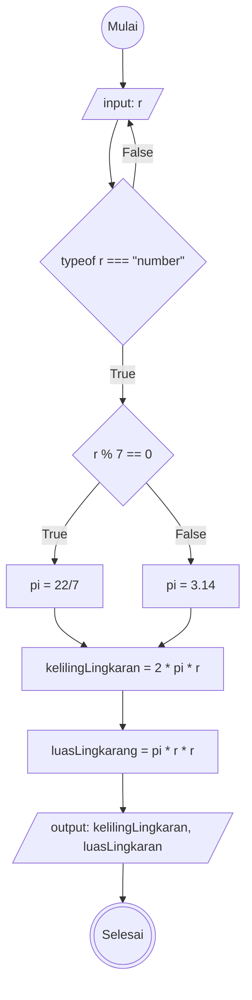

```mermaid
flowchart TD
start@{shape: circle, label: "Mulai"}
inputJari@{ shape: lean-r, label: "input: r"}
validasiInputJari@{shape: diamond, label: 'typeof r === "number"'}
decisionPi@{ shape: diamond, label: "r % 7 == 0" }
pi22@{ shape: rect, label: "pi = 22/7"}
pi31@{ shape: rect, label: "pi = 3.14"}
luasLingkaran@{ shape: rect, label: "luasLingkarang = pi * r * r" }
kelilingLingkaran@{ shape: rect, label: "kelilingLingkaran = 2 * pi * r" }
output@{ shape: lean-r, label: "output: kelilingLingkaran, luasLingkaran"}
stop@{shape: dbl-circ, label: "Selesai"}

start-->inputJari
inputJari-->validasiInputJari
validasiInputJari--True-->decisionPi
validasiInputJari--False-->inputJari
decisionPi--True-->pi22
decisionPi--False-->pi31
pi22-->kelilingLingkaran
kelilingLingkaran-->luasLingkaran
pi31-->kelilingLingkaran
luasLingkaran-->output
output-->stop
```